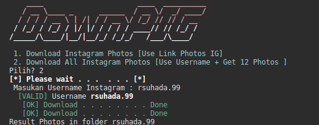
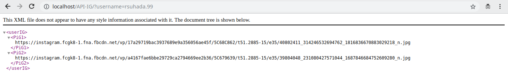

# Grabber photos Instagram 

### Usage
```
$ git clone https://github.com/suhada99/iG-gRab-Photos.git
$ cd iG-gRab-Photos/
$ chmod +x Instagram.sh
$ ./Instagram.sh
```



## API ?
Source code nya kalian bisa dapatkan di folder API-IG/ dan ada file index.php kalian upload pada local kalian.
http://localhost/API-IG/?username=rsuhada.99


